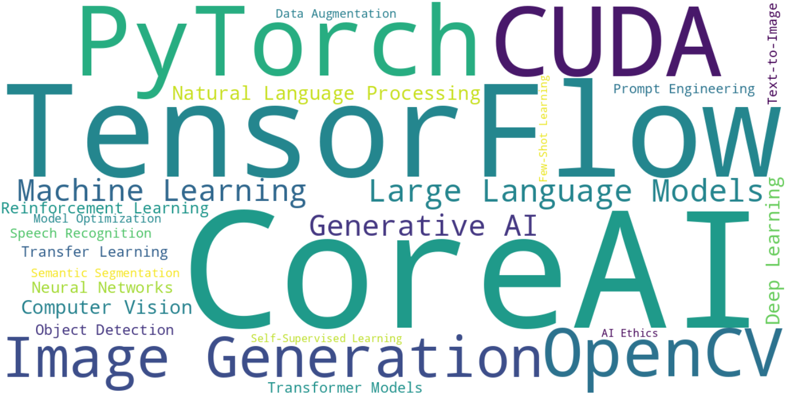

<h1>CoreAI: QuickStart</h1>

To start the `latest` version of CoreAI with CUDA, TensorFlow, PyTorch and OpenCV, and JupyterLab (accessible on the host on port 8888) as the `coreai` user within the container matching the user ID and group ID of the user running the command. The `/iti` volume is mounted within the container from the folder where the command is started. The container will output verbose information if the `CoreAI_VERBOSE` environment variable is set (remove the `-e CoreAI_VERBOSE="yes"` from the command line to disable verbose output).

```bash
# podman command
podman run --rm -it --userns=keep-id --device nvidia.com/gpu=all -e WANTED_UID=`id -u` -e WANTED_GID=`id -g` -e CoreAI_VERBOSE="yes" -v `pwd`:/iti -p 127.0.0.1:8888:8888 docker.io/infotrend/coreai:latest /run_jupyter.sh

# docker command
docker run --rm -it --runtime=nvidia --gpus all -e WANTED_UID=`id -u` -e WANTED_GID=`id -g` -e CoreAI_VERBOSE="yes" -v `pwd`:/iti -p 127.0.0.1:8888:8888  infotrend/coreai:latest /run_jupyter.sh
```

The default password for the JupyterLab is `iti`.

<hr>
<h1>CoreAI --
CUDA + TensorFlow + PyTorch + OpenCV Docker container
</h1>

Latest release: `2025a01`

`Dockerfile`s to build containers with support for CPU and GPU (NVIDIA CUDA) containers with support for TensorFlow, PyTorch and OpenCV (or combinations of), based on `nvidia/cuda` and Ubuntu 24.04 container images.

The tool's aim is to enable developers, ML and CV enthusiasts to build and test solutions `FROM` a docker container, allowing fast prototyping and release of code to the community.

We have published examples of use of the tool to support efforts in Computer Vision, Data Science, Machine Learning and Natural Language Processing.

Go to https://github.com/Infotrend-Inc/CoreAI-DemoProjects for details.

[](https://raw.githubusercontent.com/Infotrend-Inc/CoreAI/refs/heads/main/assets/wordcloud_gen.py)

- [1. Container Usage](#1-container-usage)
  - [1.1. Tag naming conventions](#11-tag-naming-conventions)
- [2. Building](#2-building)
  - [2.1. Foreword: time \& space](#21-foreword-time--space)
  - [2.2. Building methods](#22-building-methods)
    - [2.2.1. Using Makefile](#221-using-makefile)
    - [2.2.2. Using Dockerfile](#222-using-dockerfile)
  - [2.3. Build Details](#23-build-details)
  - [2.4. Available builds on DockerHub](#24-available-builds-on-dockerhub)
- [3. FAQ](#3-faq)
  - [3.1. A note on supported GPU in the Docker Hub builds](#31-a-note-on-supported-gpu-in-the-docker-hub-builds)
  - [3.2. docker compose](#32-docker-compose)
  - [3.3. Unraid](#33-unraid)
  - [3.4. virtualenv for shared Jupyter Lab usage](#34-virtualenv-for-shared-jupyter-lab-usage)
  - [3.5. Disabling GPUs when nvidia is the default Docker runtime](#35-disabling-gpus-when-nvidia-is-the-default-docker-runtime)
- [4. Version History](#4-version-history)


The CoreAI project aims to address the following challenges and provide solutions:
- **Containerized Development Environment**: CoreAI offers Docker containers with pre-configured environments containing CUDA, TensorFlow, PyTorch, and OpenCV. This allows developers to work within a consistent and isolated environment. `Dockerfile`s are available in the `BuildDetails/<release>/<components>-<versions>[<extras>]` directories for local builds and customization.
- **Fast Prototyping and Testing**: The project facilitates fast prototyping and testing by providing pre-built containers. Developers can quickly iterate on their code within the containerized environment.
- **Versioned Frameworks and Dependencies**: The project uses versioned Docker containers, making it easier for developers to work with specific versions of TensorFlow, PyTorch, OpenCV, and other components.
- **Jupyter Lab Integration**: CoreAI includes Jupyter Lab access, allowing developers to use a web-based interface for interactive development, visualization, and documentation.
- **Non-root User**: CoreAI containers run as a non-root user, which is a security best practice. The user is `coreai` with UID/GID that can be modified using the `WANTED_UID` and `WANTED_GID` environment variables (default UID/GID for `coreai` is `1024`/`1024`). The `coreai` user is `sudo`-capable.
- **Unraid**: CoreAI containers can be run on [Unraid](https://unraid.net/), a container management platform that provides a user-friendly interface for managing Docker containers.
- **`-built` builds**: It is possible to create local builds and compile TensorFlow and PyTorch from source. Shared builds use the offical `pip` packages.
- **TensorRT**: CoreAI containers can be built locally with TensorRT support (only GPU builds).
- **Available Builds**: We are providing pre-built containers from Infotrend Inc.'s Docker account at https://hub.docker.com/r/infotrend/coreai. Those are not the `-built` or `-tensorrt` version.

Building each container independently is made possible by the `Dockerfile` available in the `BuildDetails/<release>/<components>-<versions>[<extras>]` directories.
Building each container takes resources and time (counted in many cores, GB of memory and build hours).

Note: this tool was built earlier in 2023, iterations of its Jupyter Lab were made available to Infotrend's data scientists, and has been released in the past under different names. **CoreAI** is an evolution of those previous iterations.

# 1. Container Usage

Available environment variables:
- `CoreAI_VERBOSE`: Set to `yes` to enable verbose output (remove the `-e CoreAI_VERBOSE="yes"` from the command line to disable verbose output)
- `WANTED_UID`: Set to the desired user ID (recommended to set this to the user ID of the user running the command using `id -u`)
- `WANTED_GID`: Set to the desired group ID (recommended to set this to the group ID of the user running the command using `id -g`)

The container can be started using `docker` or `podman`.

An example of a command to start the container is:

```bash
# with podman
podman run --rm -it --userns=keep-id --device nvidia.com/gpu=all -e WANTED_UID=`id -u` -e WANTED_GID=`id -g` -e CoreAI_VERBOSE="yes" -v `pwd`:/iti -p 127.0.0.1:8888:8888 docker.io/infotrend/coreai:latest  /run_jupyter.sh

# with docker
docker run --rm -it --runtime=nvidia --gpus all -e WANTED_UID=`id -u` -e WANTED_GID=`id -g` -e CoreAI_VERBOSE="yes" -v `pwd`:/iti -p 127.0.0.1:8888:8888  infotrend/coreai:latest  /run_jupyter.sh
```

Decomposing the command lines:
- `[podman|docker] run`: start a container based on the specified image
- `--rm`: remove the container when it exits
- `-it`: run in interactive mode with a pseudo-TTY
- `podman` only:
  - `--userns=keep-id`: keep the user namespace of the host
  - `--device nvidia.com/gpu=all`: give access to all GPUs
- `docker` only:
  - `--runtime=nvidia`: use the NVIDIA runtime
  - `--gpus all`: give access to all GPUs
- `` -e WANTED_UID=`id -u` ``: set the desired user ID to the container's starting user's ID
- `` -e WANTED_GID=`id -g` ``: set the desired group ID to the container's starting user's group ID
- `-e CoreAI_VERBOSE="yes"`: set the verbose mode (remove the `-e CoreAI_VERBOSE="yes"` from the command line to disable verbose output).
- `` -v `pwd`:/iti ``: mount the current directory as `/iti` in the container. `/iti` is the default working directory
- `-p 127.0.0.1:8888:8888`: map port 8888 from the container to the host
- `infotrend/coreai:latest`: the image to use, use the tag that matches the build you want to use
- `/run_jupyter.sh`: the script to run, which exists by default within the container image and will start a Jupyter Lab instance (with an `iti` password). When no script is specified, the container will start a `/bin/bash` session within the new container.

##  1.1. Tag naming conventions

```text
<basename>-<release>-<components>-<versions>[<extras>]
```

The tag naming convention follows a `-` and `_`-components split to be able to be used by DockerHub.
- `<basename>`: the base name of the container image. For local builds `coreai`. For pre-built images `infotrend/coreai`
- `<release>`: the release version in the form `YY` + `Alpha` + `Revision`; where `YY` is the year (ex: `25` for 2025), `Alpha` is the release version for the given year (incremental: `a`, `b`, ...) and `Revision` is the 2-digits revision for the released version (incremental: `01`, `02`, ...). This is a unique identifier for the release that is able to be alphanumerically sorted.
- `<components>`: the components of the container image:
  - `c` for CUDA, this implies a GPU build, while the lack of it is a CPU build
  - `t` for TensorFlow
  - `p` for PyTorch
  - `o` for OpenCV
- `<versions>`: the versions of the components, `_` separated, in the order of the `<components>`
- `<extras>`: the extras of the container image, `-` separated
  - `-built`: for built TensorFlow/PyTorch. The lack of this is for pip installation. OpenCV is always built.
  - `-tensorrt`: for TensorRT support

For example `infotrend/coreai:25a01-tpo-2.18.1_2.6.0_4.11.0` can be read as:
- `basename` is `infotrend/coreai`, an image obtained from Infotrend's DockerHub.
- `release` is `25a01`, the release version: `25` for 2025, `a` for the first release of the year, `01` for the first revision of the release.
- `components` is `tpo`, `t` for TensorFlow, `p` for PyTorch, `o` for OpenCV. This is a CPU build, since no `c` for CUDA is present.
- `versions` is `2.18.1_2.6.0_4.11.0`; `2.18.1` for TensorFlow (`pip3` installed), `2.6.0` for PyTorch (`pip3` installed), `4.11.0` for OpenCV (built).

Similarly, `coreai:25a01-ctpo-12.6.3_2.18.1_2.6.0_4.11.0-built-tensorrt`:
- `basename` is `coreai`, an image built from the local build process.
- `release` is `25a01`, the release version: `25` for 2025, `a` for the first release of the year, `01` for the first revision of the release.
- `components` is `ctpo`, `c` for CUDA, `t` for TensorFlow, `p` for PyTorch, `o` for OpenCV. This is a GPU build, since `c` for CUDA is present.
- `versions` is `12.6.3_2.18.1_2.6.0_4.11.0`; `12.6.3` for CUDA, `2.18.1` for TensorFlow (built per the presence of `-built` in `extras`), `2.6.0` for PyTorch (also built), `4.11.0` for OpenCV (built).
- `extras` is `-built` and `-tensorrt`:
  - `-built` for built TensorFlow/PyTorch, 
  - `-tensorrt` for TensorRT support.

#  2. Building

The base for those container images is pulled from Dockerhub's official `ubuntu:24.04` or `nvidia/cuda:[...]-devel-ubuntu24.04` images. 

More details on the Nvidia base images are available at https://hub.docker.com/r/nvidia/cuda/
In particular, please note that **By downloading these images, you agree to the terms of the license agreements for NVIDIA software included in the images**; with further details on DockerHub version from https://docs.nvidia.com/cuda/eula/index.html#attachment-a

For GPU-optimized versions, we recommend building on a host with the supported hardware.
Using a GPU requires the installation of the NVIDIA Container Toolkit found at https://github.com/NVIDIA/nvidia-container-toolkit
Note that the NVIDIA video driver on the Linux host needs to support the version of CUDA that we are trying to build (we can see the supported CUDA version and driver version information when running the `nvidia-smi` command)

Pre-built images are available for download on Infotrend's DockerHub (at https://hub.docker.com/r/infotrend/coreai). 
Those are built using the same method provided by the `Makefile` and the corresponding `Dockerfile` used for those builds is stored in the matching `BuildDetails/<release>/<components>-<versions>[<extras>]` folder.

There are two possible methods to build local containers:
1. when building multiple versions of the container or to have a dedicated Docker `buildx` builder used; we recommend using the `Makefile`
2. when building a specific version of the container; use the matching  `BuildDetails/<release>/<components>-<versions>[<extras>]`

When using the `Makefile` method: we will use the `make` command to generate the content of the `BuildDetails` directory which will place all files required for building the container within the build specific folder. For a `25a01` release, for `po` a `BuildDetails/25a01/po-2.6.0_4.11.0` directory (following the naming convention) is created and contains the build artifacts including a `Dockerfile`.

When using the `BuildDetails/<release>/<components>-<versions>[<extras>]/Dockerfile` method: we can build the container using the files within that directory.

## 2.1. Foreword: time & space

Building the containers requires the docker build step to have internet access. The process is CPU, RAM and storage space intensive and will require storage space for the build step and for the final image (the largest image is about 40GB, close to 100GB of reclaimable space is generated by Docker `buildx`)

For example, when building the `25a01` release, the following is a table generated from the output of the `docker image ls` command to illustrate disk usage:

| TAG | SIZE | Estimated build time |
| --- | --- | --- |
| 25a01-ctpo-12.6.3_2.18.1_2.6.0_4.11.0-built-tensorrt | 36.1GB | 300 minutes | 
| 25a01-ctpo-12.6.3_2.18.1_2.6.0_4.11.0-built | 19.9GB | 240 minutes |
| 25a01-ctpo-12.6.3_2.18.1_2.6.0_4.11.0 | 24.5GB | 40 minutes |
| 25a01-cpo-12.6.3_2.6.0_4.11.0 | 19.9GB | 30 minutes |
| 25a01-cto-12.6.3_2.18.1_4.11.0 | 19.5GB | 30 minutes |
| 25a01-tpo-2.18.1_2.6.0_4.11.0-built | 8.19GB | 80 minutes |
| 25a01-tpo-2.18.1_2.6.0_4.11.0 | 8.16GB | 15 minutes |
| 25a01-po-2.6.0_4.11.0 | 6.21GB | 10 minutes |
| 25a01-to-2.18.1_4.11.0 | 7.32GB | 10 minutes |

The build time is estimated from local builds of all listed containers on a system with an AMD 5950x (16-cores, `NUMPROC=32`), NVIDIA RTX 4090 and 128GB of RAM. 
Your build time may vary. but those values provide some idea of scale and time complexities of the build process.

## 2.2. Building methods

###  2.2.1. Using Makefile

When building multiple versions of the container or to have a dedicated Docker `buildx` builder used; we recommend using the `Makefile`.
This method will generate a build specific `Dockerfile` 

Type `make` to get the list of targets and some details of the possible builds.

It is possible to adapt the content of the `Makefile` to build custom solutions. 
For example, the default is not to build OpenCV non-free or build FFmpeg with libnpp, as those would make the images unredistributable and any release on our Dockerhub is made with "redistributable" packages (see `CoreAI_ENABLE_NONFREE`). 
It is also possible to modify the `DNN_ARCH_CUDA` or `DNN_ARCH_TORCH` variables to build for a specific GPU architecture (compared to building for a range of architectures).

We will see the result of this command for the `25a01` release:

```text
**** CoreAI Docker Image tag ending: 25a01
**** Docker Runtime: GPU
  To switch between GPU/CPU: add/remove "default-runtime": "nvidia" in /etc/docker/daemon.json then run: sudo systemctl restart docker

 Tag naming convention: [CoreAI_Release] - [COMPONENTS] - [[CUDA_version _]? [Tensorflow_version _]?  [PyTorch_version _]? [OpenCV_version]] [-tensorrt] [-built]
   CoreAI_Release: 25a01 ( YY + release letter (a, b, ...) for given year) + release revision
   Components: c=cuda t=tensorflow p=pytorch o=opencv
   Versions: versions of the selected components, separated by underscores
   TensorRT support: requires GPU and "-built"
   "-built" for built TensorFlow/PyTorch, "" for pip installation

*** Available CoreAI Docker images to be built (make targets):

  pip_tpo_all -- pip for CPU:
    pip_to OR pip_po OR pip_tpo :
      25a01-to-2.18.1_4.11.0
      25a01-po-2.6.0_4.11.0
      25a01-tpo-2.18.1_2.6.0_4.11.0
  pip_ctpo_all -- pip for GPU:
    pip_cto OR pip_cpo OR pip_ctpo :
      25a01-cto-12.6.3_2.18.1_4.11.0
      25a01-cpo-12.6.3_2.6.0_4.11.0
      25a01-ctpo-12.6.3_2.18.1_2.6.0_4.11.0
  build_pip: pip_tpo_all pip_ctpo_all

  blt_tpo_all -- built for CPU:
    blt_tpo :
      25a01-tpo-2.18.1_2.6.0_4.11.0-built
  blt_ctpo_all -- built for GPU:
    blt_ctpo :
      25a01-ctpo-12.6.3_2.18.1_2.6.0_4.11.0-built
  build_blt: blt_tpo_all blt_ctpo_all

  blt_ctpo_tensorrt -- built with TensorRT support:
      25a01-ctpo-12.6.3_2.18.1_2.6.0_4.11.0-built-tensorrt

  build_all: build ALL previously listed targets
```

Those follow the description of the tag naming convention.
For `make` purpose, we differentiate from `pip3` and `built` by the suffixes `pip_` and `blt_`.
For example, `make pip_tpo` will build the `25a01-tpo-2.18.1_2.6.0_4.11.0` image, `make blt_ctpo_all` will build the all the `blt_ctpo` images --here, only one-- the  `25a01-ctpo-12.6.3_2.18.1_2.6.0_4.11.0-built` image and `make blt_ctpo_tensorrt` will build the `25a01-ctpo-12.6.3_2.18.1_2.6.0_4.11.0-built-tensorrt` image.

Each requested build will create/replace the `Dockerfile` in the matching `BuildDetails/<release>/<components>-<versions>[<extras>]` folder. For example, `make blt_ctpo_tensorrt` will create/replace the `Dockerfile` in the `BuildDetails/25a01/ctpo-12.6.3_2.18.1_2.6.0_4.11.0-built-tensorrt` folder.

In addition to the `Dockerfile`, the `make` method will copy required components within the matching `BuildDetails` folder (`*.sh` scripts), run a minimum set of tests to confirm a successful build (see the `*.testlog` files in the folder where the `Makefile` is) and generate some post build artifacts that details the installed components (the `*.txt` files in the `Dockerfile` location).

Note: Local builds will not have the `infotrend/` added to their base name as those are only for release to Docker hub by maintainers.

###  2.2.2. Using Dockerfile

As detailled in the previous section, each time we request a specific `make` target, a dedicated `Dockerfile` is built in the `BuildDetails/<release>/<components>-<versions>[<extras>]` folder.

Each `Dockerfile` contains `ARG` and `ENV` values that match the specific build parameters.

Those `Dockerfile` can be used directly by developers to build and integrate their modifications to build a specific feature.

When the maintainers upload this image to Dockerhub, that image will be preceded by `infotrend/`.

When choosing to build a container image on specific hardware, please be patient, building any of those images might take a long time (counted in hours for `-built` images).

To build a local image this way, find the corresponding `Dockerfile` and in the directory where the file is located: `docker build -f Dockerfile --tag custombuild:local .`

For example, to build the `BuildDetails/25a01/25a01-po-2.6.0_4.11.0/Dockerfile` and tag it as `po:local`, run:
```
% cd BuildDetails/25a01/25a01-po-2.6.0_4.11.0
% docker build -f Dockerfile --tag po:local .
```

> ℹ️ When using an existing `Dockerfile`, please update the `ARG CoreAI_NUMPROC=` line with the value of running the `nproc --all` command.
> The value in the `Dockerfile` reflects the build as it was performed for testing.

The `Makefile` contains most of the variables that define the versions of the different frameworks.
The file has many comments that allow developers to tailor the build.

##  2.3. Build Details

The [`README-BuildDetails.md`](README-BuildDetails.md) file is built automatically from the content of the `BuildDetails` directory and contains links to different files stored in each sub-directory.

It reflects each build's detailed information, such as (where relevant) the Docker tag, version of CUDA, cuDNN, TensorFlow, PyTorch, OpenCV, FFmpeg and Ubuntu. Most content also links to sub-files that contain further insight into the system package, enabled build parameters, etc.

##  2.4. Available builds on DockerHub

The `Dockerfile` used for a Dockerhub pushed built is shared in the `BuildDetails` directory.
Only builds that are not `-built` or `-tensorrt` are available on Dockerhub.

We will publish releases into [Infotrend Inc](https://hub.docker.com/r/infotrend/)'s Docker Hub account.
There you can find other releases from Infotrend.

The tag naming reflects the [Tag naming conventions](#Tagnamingconventions) section above.

`latest` is used to point to the most recent release of the `ctpo` build.

The different base container images that can be found there are all in the https://hub.docker.com/r/infotrend/coreai repository.
The tag naming convention is the same as the one used in the [Tag naming conventions](#Tagnamingconventions) section above.


#  3. FAQ

##  3.1. A note on supported GPU in the Docker Hub builds

A minimum Nvidia driver version is needed to run the CUDA builds. 
[Table 1: CUDA Toolkit and Compatible Driver Versions](https://docs.nvidia.com/deploy/cuda-compatibility/index.html#binary-compatibility__table-toolkit-driver) and [Table 2: CUDA Toolkit and Minimum Compatible Driver Versions](https://docs.nvidia.com/cuda/cuda-toolkit-release-notes/index.html) as well as the `nvidia-smi` command on the host will help us determine if a specific version of CUDA will be supported.

Not all GPUs are supported in the Docker Hub builds. 
The containers are built for "compute capability (version)" (as defined in the [GPU supported](https://en.wikipedia.org/wiki/CUDA#GPUs_supported) Wikipedia page) of 6.0 and above (ie Pascal and above). 

If you need a different GPU compute capability, we can edit the `Makefile` and alter the various `DNN_ARCH_` matching the one that we need to build and add the needed architecture. Then type `make` to see the entire list of containers that the release we have obtained can build and use the exact tag that we want to build to build it locally (on Ubuntu, we will need `docker` and `build-essential` installed --at least-- to do this). 
Building a container image takes a lot of CPU and can take multiple hours, so we recommend to build only the target needed.

##  3.2. docker compose

It is also possible to run the container in `docker compose`.
It is recommended to start the Jupyter endpoint in such cases.

Follow the [GPU support](https://docs.docker.com/compose/gpu-support/) instructions to match the usage, and adapt the example [`compose.yaml`](assets/compose.yaml) available in the [`assets`](assets) directory) as needed:

1. Create the `iti` directory in the location where the `compose.yaml` file will be stored as the user running the command
2. Create the `compose.yaml` file in the same location (and adapt the `WANTED_UID` and `WANTED_GID` values)
3. Start the stack using `docker compose -f compose.yaml up -d`

## 3.3. Unraid

The container is ready to be added to [Unraid](https://unraid.net/)'s Community Applications.
We will update this section when the container is added.

In the meanwhile, you can find a [Infotrend-CoreAI.xml](assets/Infotrend-CoreAI.xml) file in the [assets](assets) directory.

## 3.4. virtualenv for shared Jupyter Lab usage

When using the Jupyter version of CoreAI with other users, it might be better to use a `virtualenv` for the packages to be installed in. 
In the following, we will create a `myvenv` virtual environment in the `/iti` directory, that will show up in the list of available kernels.

In a Terminal (preferably running a `bash` shell) in the Jupyter Lab, run:

```
python3 -m venv --system-site-packages myvenv
source myvenv/bin/activate
pip3 install ipykernel
python -m ipykernel install --user --name=myvenv --name=myvenv --display-name="Python (myvenv)"
```

Make sure to select the proper kernel in the notebook.
When using this kernel, it is still recommendeded to run any `pip` command from the terminal with the virtual environment activated to ensure the packages are installed in the expected location (i.e. not a global installation). As an alternative for `pip` commands to run with the proper installation directory, we will need to use `! . ./myvenv/bin/activate` before the command. For example: `!. ./myvenv/bin/activate; pip install -r requirements.txt` 

## 3.5. Disabling GPUs when nvidia is the default Docker runtime

If `"default-runtime": "nvidia"` in set in `/etc/docker/daemon.json` and want to hide the GPUs from a running container, add `NVIDIA_VISIBLE_DEVICES=void` before the `docker run` command.

# 4. Version History

 - 25a01: Initial release (20250408) -- CUDA 12.6.3, Ubuntu 24.04, PyTorch 2.6.0, TensorFlow 2.18.1, OpenCV 4.11.0
